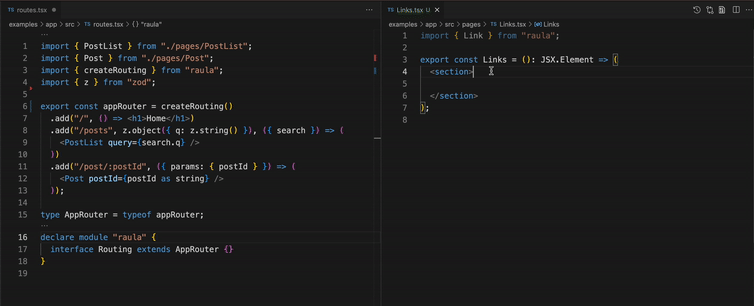

# Raula

Raula is a typesafe routing library for the React. You can choose a destination from intellisense of vscode with no code generation.



## Motivation

There are already several awesome routing libraries for the React such as React Router, Expo Router and Tanstack Router. All of them has great features and allows you to manage routing.

But, I think no one uses full-power TypeScript inference like tRPC so I created this library.

## 🌏  Open in the Cloud 
Click the button below to start a new development environment:

[](https://vscode.dev/github/toyamarinyon/raula/tree/main/examples/app)
[](https://glitch.com/edit/#!/import/github/toyamarinyon/raula/tree/main/examples/app)
[](https://codespaces.new/toyamarinyon/raula/tree/main/examples/app)
[](https://codesandbox.io/s/github/toyamarinyon/raula/tree/main/examples/app)
[](https://stackblitz.com/github/toyamarinyon/raula/tree/main/examples/app)
[](https://replit.com/github/toyamarinyon/raula/tree/main/examples/app)
[](https://app.codeanywhere.com/#https://github.com/toyamarinyon/raula/tree/main/examples/app)
[](https://gitpod.io/#https://github.com/toyamarinyon/raula/tree/main/examples/app)

## Example

You can try example project on the browser with StackBlitz.

[](https://stackblitz.com/github/toyamarinyon/raula/tree/main/examples/app)

# Getting Started

```bash
# npm
npm install @raula/router
# yarn
yarn add @raula/router
# pnpm
yarn add @raula/router
```
# Tutorial

WIP

# Milestones

- [ ] Define a sub route.
- [ ] Define a auth route.(middleware)
